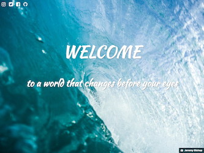

# Problem: Responsive Splash Page

In this exercise, you'll practice using **media queries** to create responsive web pages.

To complete the exercise, you will need to add rules to the included `css/style.css` file in order to style the `index.html` file so that it has has the following responsive appearance:

- On extra-small screens (less than `598px` in width):

    

- On small screens (more than `598px` in width):

    

- On medium screens (more than `768px` in width):

    

- On large screens (more than `992px` in width):

    

Instructions for achieving this appearance are detailed below.

1. To make sure the responsive styling is specified by you and not the browser, add a [viewport meta tag](https://info340.github.io/responsive-css.html#specifying-viewport) to the HTML's `<head>` section.

    Note that this is the **only** change you should make to the `.html` file for this exercise.

2. Following a mobile-first approach, the "default" styling will be for extra-small screens.

    - The `body` should have a margin of `.5rem` of around all the content. The background should be a nice blue (`#93b8d7`), and the text content should be colored `white`.

    - The "navigation" icon links (top-right corner) should also be `white` and increased in size to `2.5rem`. Add `.5em` of space to the right of each link's content (the space is measured in `em` so it wil adjust with the icon sizes!)

        Additionally, the "social media" links should **not** be shown at this screen size. _Hint_: use the `display` property.
    
    - The page's text main content should be [_centered_](https://developer.mozilla.org/en-US/docs/Web/CSS/text-align). It should use the included `Kaushan Script` font family, with a fallback to the generic `fantasy` family if that isn't available (on my computer, this default is [Papyrus](https://www.fastcodesign.com/3055865/meet-the-man-who-created-papyrus-the-worlds-other-most-hated-font). You're welcome.)

        The main content should have have a top margin equal to `23` percent of the [viewport height](https://developer.mozilla.org/en-US/docs/Web/CSS/length#Viewport-percentage_lengths). This is an example of using CSS units to allow the the text to stay more or less vertically centered as the device size changes. Note that a Flexbox would be a more robust approach to centering content vertically (but also more work!).

        The first line (top-level heading) should have a font-size of `4rem`, and the second line should have a font-size of `2rem`. The second line should also have a `2em` margin above it.

    - The footer (an image credit) should **not** be displayed, since there is no image!

3. Add a _media query_ so that the styling changes on devices with a screen width of **`598px` or greater**. You can test your changes by resizing the browser window or using the [device toolbar](https://developers.google.com/web/tools/chrome-devtools/device-mode/emulate-mobile-viewports) in the Chrome developer tools.

    - At this size, the "hamburger menu" icon should disappear, and the social media links should be shown instead (as a `block` element). _Hint:_ again, use the `display` property!

4. Add a _media query_ so that the styling changes on devices with a screen width of **`768px` or greater**.

    - At this size, the body's background should change to an image (`splash-md.jpg` found in the `img/` folder. Remember that CSS paths are relative to the _.css file_). The image should be positioned in the `center`, and `cover` the background.

    - You will also need to make the `html` have a `height` of `100%` so that the image stretches down the screen.

    - Because there is now an image, you should also display the image credit (the footer) at this screen with. The footer should be `fixed` to the bottom right of the window.

    - The background image can make the text a little hard to read. Improve this by adding a [text-shadow](https://developer.mozilla.org/en-US/docs/Web/CSS/text-shadow) to the `main` content. The shadow should have `1px` offset in each direction, and be colored a very dark blue `#153c43`.

5. Add a _media query_ so that on large devices (screen width **`992px` or greater**), the styling changes yet again:

    - The background image should increase in resolution to support the larger area (use `splash-lg.jpg` in the `img/` folder).

    - On large desktops like this size, users generally have a mouse so don't need large icons to tap on. Change the navigation links to have a smaller font size of `1.5rem`

    - There is also more space, so you should increase the text size to `5rem` for the first line (the `h1`) and `3rem` for the second line (the `h2`).

5. Finally, add one more _media query_ for extra-large devices (screen width **`1200px` or greater**).

    - For extra-large screens, use a very high resolution background image (`splash-xl.jpg` in the `img/` folder).
