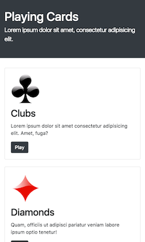
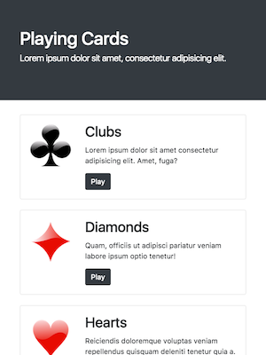
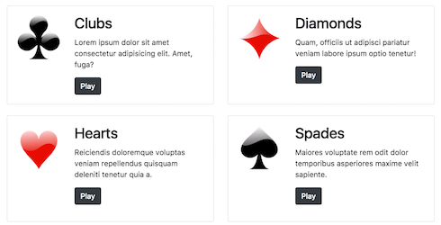
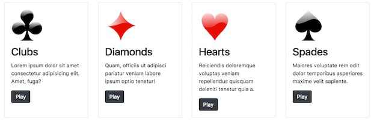

# Problem: Bootstrap Cards

In this exercise, you'll practice styling a page using the **Bootstrap** CSS framework, and its responsive grid system in particular..

To complete the exercise, you will need to add structural content (e.g., `div` elements) and utility classes to the included `index.html` file so that it has has the following responsive appearance:

- On extra-small screens (less than `598px` in width):

    

- On small screens (more than `598px` in width), the images move to the sides of the text:

    

- On medium and large screens (more than `768px` in width), the cards arrange into a 2x2 grid:

    

- On extra-large screens (more than `1200px` in width), the cards line up in a single row, with the images back on top:

    

Instructions for achieving this appearance are detailed below.

1. Start by including a `<link>` to the Bootstrap 5 CSS framework (use their CDN) in the document's `<head>`. This should add some simple font styling to the page.

    - You'll also need to add a `viewport` meta element, as in the previous responsive exercise.

2. The content inside the `<header>` and `<main>` elements should be inside of Bootstrap [containers](https://getbootstrap.com/docs/5.0/layout/containers/) to give them appropriate padding. To do this, add **additional** `
` elements with an appropriate class to "wrap" the content. Do _not_ turn the `header` and `main` into containers&mdash;they should have containers as children!

    (Note that wrapping elements in a `div` with a Bootstrap class is a very common pattern, and you will do it a lot in this exercise!)

3. The header should be styled like a [Jumbotron](https://getbootstrap.com/docs/5.0/examples/jumbotron/). To achieve this:

    - The `<header>` element should be made into a [fluid container](https://getbootstrap.com/docs/5.0/layout/containers/#fluid-containers) (that will fill the page). It should be [colored](https://getbootstrap.com/docs/5.0/utilities/colors/) with a "dark" background and "white" text. Finally, it should also have [padding](https://getbootstrap.com/docs/5.0/utilities/spacing/) in the "y" direction with a spacing size of `5`. 

    - The "subtitle" paragraph should stand out as a [lead](https://getbootstrap.com/docs/5.0/content/typography/#lead)

    Note that because the jumbotron has the _container_ `div` as a child, it's background will be "full-width" while the text still has spacing on the sides!

4. Each of the "cards" indicated in the HTML should be styled as a [Card](https://getbootstrap.com/docs/5.0/components/card/) component. Yes, this means you will need to make the same set of changes 4 times... consider it practice!

    - Each card's content (both the image and the text) should be part of the card's "body", with [appropriate padding](https://getbootstrap.com/docs/5.0/components/card/#body). Note that this will require you to wrap the content in an additional `
`.

      **Important** The image should be considered part of the body, _not_ a "top image"&mdash;it doesn't go to the edge of the card!

    - Use the `.card-title` and `.card-text` classes to style the card's title and text respectively.

    - The "Play" links should be styled as [dark-colored buttons](https://getbootstrap.com/docs/5.0/components/buttons/) (but they should remain links!)

    - Use a [utility class](https://getbootstrap.com/docs/5.0/utilities/spacing/) to give the `` elements _bottom padding_ equal to the "spacer" size (a spacing size of `3`).

    - Also use a utility class to give each _`.card`_ 1.5 "spacers" worth of _bottom margin_ (a spacing size of `4`). This will put space between the cards. 

5. By default the cards will be lined up in a 1x4 stack. However, on larger devices they should be arranged in a 2x2 or 4x1 grid. To support this, place all of the cards into a single `.row` of a Bootstrap [Grid](https://getbootstrap.com/docs/5.0/layout/grid/).

    - To do this, you'll need to add a new `
` to provide the `.row`, as well as to **"wrap" each `.card`** in a `
` that will provide the grid column size. That is, each grid column should contain a "card" as a child element, rather than having each grid column "be" a card.

        It's best practice to think about the Bootstrap grid as being and additional "structuring" to hold your content, rather than the content being part of the grid itself.

    - On _medium_ or larger screens, each card should take up 1/2 of the row (e.g., 6 "columns"). On _extra-large_ or larger screens, each card should take up 1/4 of the row.

    - Make each card the same "height" on large or larger displays by making each _grid column_ into it's own [flexbox container](https://getbootstrap.com/docs/5.0/utilities/flex/) (e.g., via a utility class that gives the `display:flex` property). This will cause the `.card` to fill that element.

6. When there is sufficient room (i.e., on _small_, _medium_, or _large_ displays), the image icon should sit to the left side of the text. The easiest way to do this to make the **body of the card** into _another_ grid! Then you can use the responsive sizing utilities to put the image into a different "column" than the rest of the content!

    - _For each card_, you will need to wrap the body content inside of another `.row` div. Inside that row div, you'll add two child "columns" (i.e., `div` elements): one containing the ``, and one containing the rest of the content.

    - On _small_ or larger displays, the image column should have an `auto` calculated width based on the ["natural width"](https://getbootstrap.com/docs/5.0/layout/grid/#variable-width-content) of the image, and the text column should have a width that takes up the [remaining space](https://getbootstrap.com/docs/5.0/layout/grid/#setting-one-column-width).

    - Additionally, on _extra large_ or larger displays, the image column should take up the entire row (e.g., 12 "columns") 

    Note that this will cause the card content to be in "columns" on small or larger devices... but on extra-large displays the overall `container` sizing means that each card isn't large enough for them to be in columns, so they will go back to stacking as desired!
